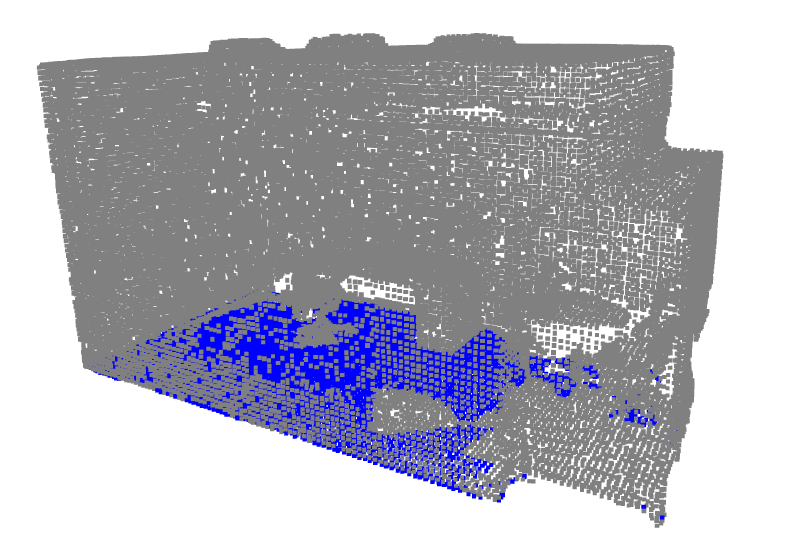

# 🏠 3D Room Segmentation Pipeline using Point Clouds and PointNet++


[](LICENSE)
[](https://github.com/yanx27/Pointnet_Pointnet2_pytorch)
[](http://buildingparser.stanford.edu/dataset.html)

---

A comprehensive pipeline for 3D room segmentation using point cloud data, integrating PointNet++, plane fitting and clustering techniques. This project covers the full process from data acquisition and preprocessing to segmentation and visualization, applied to datasets like **[Stanford 2D-3D Indoor Spaces (S3DIS)](http://buildingparser.stanford.edu/dataset.html)** and **[KITTI](https://www.cvlibs.net/datasets/kitti/)**.

---

## Project Overview  
The goal of this project is to build an accurate and efficient segmentation pipeline capable of processing large 3D indoor environments. By leveraging **PointNet++** for semantic segmentation and integrating traditional point cloud methods, the pipeline achieves high performance in segmenting and visualizing complex 3D spaces.

### Key Features:
- Data Acquisition & Preprocessing
   - Supports Stanford 2D-3D Indoor Scenes (S3DIS) and KITTI datasets.  
   - Downsampling, noise filtering and outlier removal using Open3D.  
   - Voxel downsampling and statistical outlier removal.  

- 3D Segmentation & Clustering 
   - Plane segmentation (RANSAC) to detect ground and walls.  
   - Region growing and DBSCAN for clustering and object detection.  
   - Semantic segmentation using PointNet++.  

- Visualization
   - Color-coded segmentation outputs.  
   - Real-time 3D point cloud visualization with Open3D.  
   - Confusion matrices and classification reports to evaluate performance. 


---

## Project Structure  

```
3D-Room-Segmentation-Pipeline/
 ├── 📁 assets 
 ├── 📁 docs
 └── 📂 notebooks 
```
---

## Results
Here are some outputs from the segmentation pipeline, showcasing various stages such as preprocessing, segmentation and PointNet predictions.

### Original Point Cloud


### Preprocessed Point Clouds

#### Radius Outlier Removal


#### 3D Harris Corner Detection


#### Ground Plane Segmentation


### Semantic Segmentation for this Pipeline


### PointNet Semantic Segmentation


### Full pipeline run on Kitti


---

## Contact

For any questions or collaboration opportunities, feel free to reach out at [hey@njoguevans.me](mailto:hey@njoguevans.me).